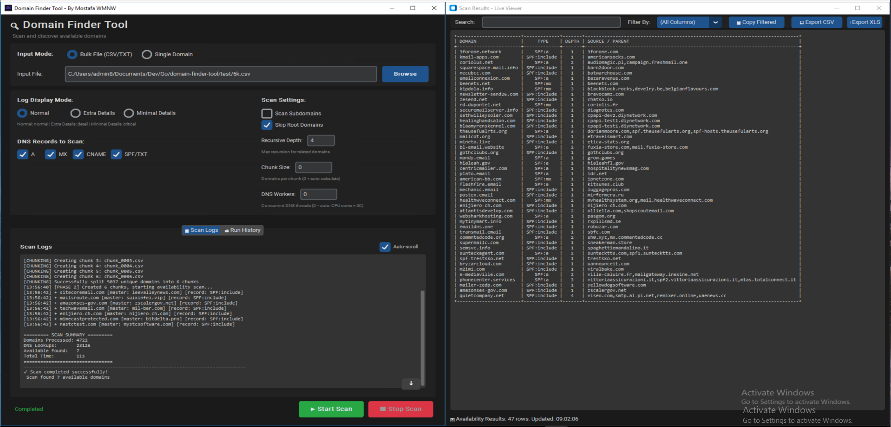
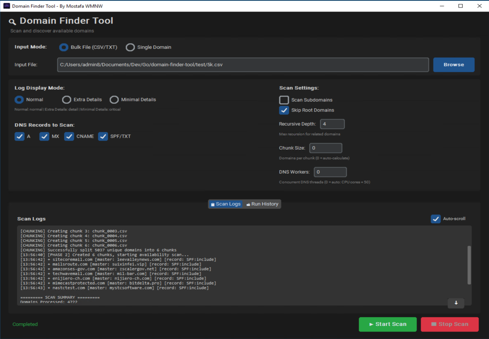
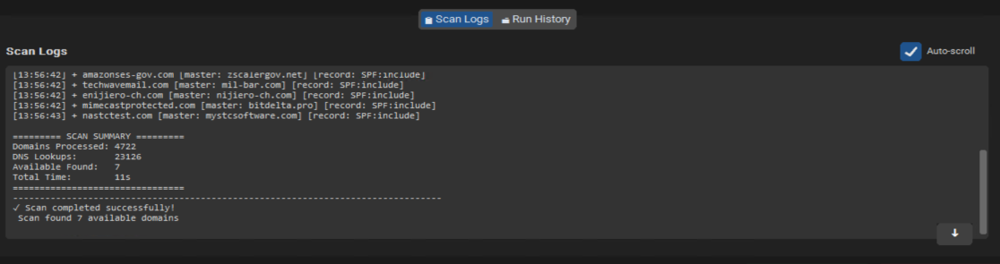
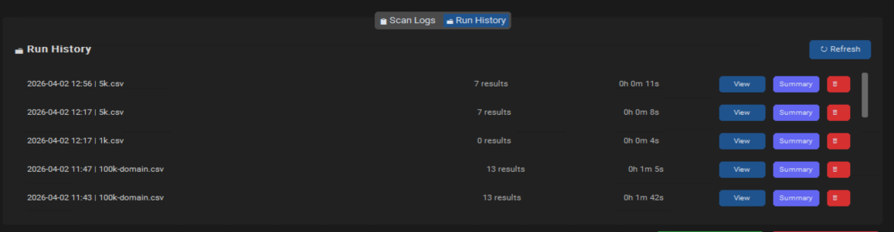
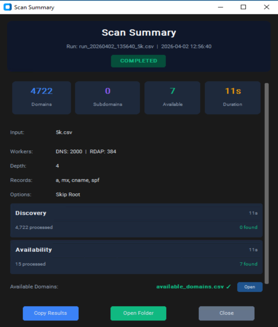
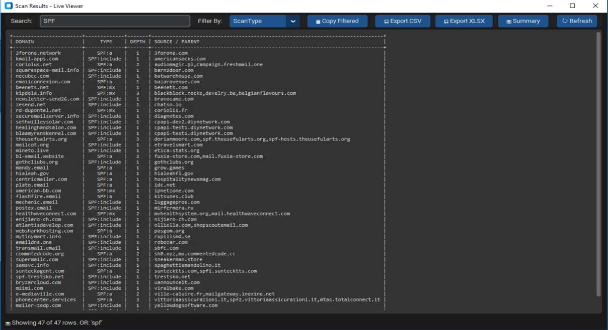

# Rapport d'Application – Domain Finder Tool

---

## INFORMATIONS DU DOCUMENT

| **Champ** | **Valeur** |
|-----------|------------|
| **Préparé pour** | Web Media Network |
| **Préparé par** | MOSTAFA BENMOUSA (WMNW) |
| **Encadré par** | Rachid AMIRATE (Manager Junior) |
| **Téléphone** | +212 622715935 |
| **Email** | benmousamostafa03@gmail.com |
| **Année** | 2026 |

---

## 1. Présentation Générale

### Nom de l'application
**Domain Finder Tool**

### Objectif principal
Domain Finder Tool est une application de découverte et d'analyse de domaines conçue pour identifier les domaines disponibles ou expirés. Elle combine un backend haute performance en Go avec une interface utilisateur moderne en Python (CustomTkinter), offrant une solution complète pour les professionnels du marketing digital et du SEO.




---

## 2. Résumé Exécutif

### Problème résolu par l'application
La recherche manuelle de domaines disponibles est un processus chronophage et inefficace. Les professionnels doivent vérifier la disponibilité de nombreux domaines, analyser leurs enregistrements DNS, et identifier les sous-domaines pertinents. Domain Finder Tool automatise l'ensemble de ce processus.

### Valeur ajoutée
- **Automatisation complète** : Scan DNS parallèle et vérification RDAP en temps réel
- **Architecture hybride performante** : Backend Go pour la vitesse, GUI Python pour l'ergonomie
- **Découverte intelligente** : Identification automatique des sous-domaines avec profondeur récursive configurable

### Bénéfices clés
| Bénéfice | Description |
|----------|-------------|
| **Gain de temps** | Traitement parallèle de milliers de domaines en minutes |
| **Précision** | Vérification RDAP officielle pour la disponibilité |
| **Flexibilité** | Export CSV/XLSX pour intégration avec autres outils |
| **Traçabilité** | Historique complet des scans avec métadonnées |

---

## 3. Vue d'Ensemble de l'Application

### Description globale
Domain Finder Tool est une application desktop Windows qui permet de scanner des listes de domaines pour identifier ceux qui sont disponibles. Elle utilise le protocole RDAP (Registration Data Access Protocol) pour vérifier officiellement la disponibilité des domaines, et effectue des analyses DNS complètes.

### Fonctionnalités principales

| Fonctionnalité | Description |
|----------------|-------------|
| **Scan DNS** | Analyse des enregistrements A, MX, CNAME, SPF/TXT |
| **Vérification RDAP** | Contrôle officiel de disponibilité des domaines |
| **Découverte de sous-domaines** | Identification automatique avec profondeur configurable |
| **Scan récursif** | Exploration des domaines liés jusqu'à 4 niveaux |
| **Export multi-format** | CSV et XLSX avec données filtrables |
| **Historique des runs** | Sauvegarde automatique de chaque session |

### Environnements supportés
- **OS principal** : Windows 10/11
- **Compatibilité** : Cross-platform (Linux, macOS) pour le backend Go
- **Prérequis** : Go 1.21+, Python 3.10+



---

## 4. Description de l'Interface Utilisateur

### Modes d'entrée

L'application propose deux modes d'entrée distincts :

| Mode | Description | Cas d'usage |
|------|-------------|-------------|
| **Bulk File (CSV/TXT)** | Chargement d'un fichier contenant une liste de domaines | Scan de masse, analyse de portefeuilles |
| **Single Domain** | Saisie d'un domaine unique | Test rapide, analyse ciblée |

### Paramètres de scan

| Paramètre | Valeur par défaut | Description |
|-----------|-------------------|-------------|
| **Recursive Depth** | 4 | Profondeur maximale d'exploration des domaines liés |
| **DNS Workers** | Auto (CPU × 50) | Nombre de threads DNS parallèles |
| **RDAP Workers** | Auto (CPU × 8) | Nombre de vérifications RDAP simultanées |
| **Chunk Size** | Auto | Domaines traités par lot (optimisation mémoire) |
| **DNS Timeout** | 2 secondes | Délai d'attente des réponses DNS |

### Types de DNS analysés

- **A** : Enregistrement d'adresse IPv4
- **MX** : Serveurs de messagerie
- **CNAME** : Alias canoniques
- **SPF/TXT** : Politiques d'envoi d'emails

### Options avancées

| Option | Effet |
|--------|-------|
| **Scan Subdomains** | Active la découverte de sous-domaines |
| **Skip Root Domains** | Ignore la vérification des domaines racine |
| **Log Mode** | Normal / Extra Details / Minimal Details |

### Logs et résultats

L'interface affiche les logs en temps réel avec trois niveaux de détail :
- **Normal** : Informations essentielles
- **Extra Details** : Journalisation verbose pour debugging
- **Minimal Details** : Uniquement les informations critiques



---

### Onglet Run History (Historique des exécutions)

L'application propose un onglet dédié à l'historique des scans, permettant de consulter et gérer les exécutions précédentes.

| Fonctionnalité | Description |
|----------------|-------------|
| **Liste des runs** | Affichage des 50 dernières exécutions (timestamp, fichier source, résultats, durée) |
| **Bouton View** | Ouvre le visualiseur de résultats pour le run sélectionné |
| **Bouton Summary** | Affiche le résumé détaillé du scan via ScanSummaryDialog |
| **Bouton Delete** | Supprime définitivement le run et ses fichiers associés |
| **Refresh** | Actualise la liste depuis le fichier history.json |

Chaque run est stocké dans `~/.domain-finder/runs/run_YYYYMMDD_HHMMSS/` avec :
- `available_domains.csv` : Domaines disponibles trouvés
- `subdomains.csv` : Sous-domaines découverts
- `history.json` : Métadonnées complètes du scan
- `scan.log` : Logs détaillés de l'exécution



---

### Scan Summary Dialog (Résumé de scan)

Le **ScanSummaryDialog** est une fenêtre modale qui affiche un résumé complet d'une exécution de scan, basée sur les données du fichier `history.json`.

#### Sections affichées :

| Section | Contenu |
|---------|---------|
| **Métriques clés** | Cartes colorées : Domains traités, Subdomains trouvés, Domaines disponibles, Durée totale |
| **Configuration** | Fichier d'entrée, workers DNS/RDAP, profondeur, types DNS analysés, options activées |
| **Scan Phases** | Visualisation des phases Discovery et Availability avec items traités/trouvés |
| **Output Files** | Liens vers les fichiers générés (CSV, log) avec indicateur de présence |
| **Errors** | Liste des erreurs rencontrées (limitée aux 10 premières) |

#### Actions disponibles :
- **Copy Results** : Copie le résumé textuel dans le presse-papiers
- **Open Folder** : Ouvre le dossier du run dans l'explorateur de fichiers
- **Close** : Ferme la fenêtre de résumé



---

## 5. Fonctionnement de l'Application

### Flux d'exécution

```
┌─────────────────┐    ┌─────────────────┐    ┌─────────────────┐
│   CHARGEMENT    │───▶│  CONFIGURATION   │───▶│    DISCOVERY   │
│  CSV / Domain   │    │   Paramètres     │    │  Sous-domaines  │
└─────────────────┘    └─────────────────┘    └─────────────────┘
                                                      │
                                                      ▼
┌─────────────────┐    ┌─────────────────┐    ┌─────────────────┐
│     EXPORT      │◀───│    RÉSULTATS    │◀───│  AVAILABILITY   │
│  CSV / XLSX     │    │   Affichage     │    │   RDAP Check    │
└─────────────────┘    └─────────────────┘    └─────────────────┘
```

### Phase 1 : Chargement des données
- Lecture du fichier CSV/TXT (streaming pour gros volumes)
- Déduplication automatique des domaines
- Chargement des exclusions (suffixes publics)

### Phase 2 : Configuration du scan
- Définition des workers DNS/RDAP
- Sélection des types d'enregistrements DNS
- Configuration de la profondeur récursive

### Phase 3 : Discovery (Découverte)
- Scan DNS des domaines d'entrée
- Identification des sous-domaines
- Exploration récursive des domaines liés

### Phase 4 : Availability (Disponibilité)
- Vérification RDAP pour chaque domaine découvert
- Filtrage par TLD supportés
- Identification des domaines disponibles

### Phase 5 : Consultation des résultats
- Affichage dans le visualiseur intégré
- Recherche et filtrage interactif
- Export vers CSV ou XLSX



---

## 6. Résultats et Exports

### Affichage des résultats

Le visualiseur de résultats offre :

| Fonctionnalité | Description |
|----------------|-------------|
| **Tableau interactif** | Colonnes : Domain, Type, Depth, Source/Parent |
| **Recherche OR** | Recherche multi-termes avec virgules |
| **Filtrage par colonne** | Domain, ScanType, Source |
| **Rafraîchissement auto** | Mise à jour toutes les 2 secondes |

### Export CSV

```csv
Domain,ScanType,Depth,Source
example.com,Available,1,parent.com
sub.example.com,Discovered,2,example.com
```

### Export XLSX

- Format Excel avec colonnes auto-ajustées
- En-têtes formatés
- Compatible avec tableurs (Excel, LibreOffice Calc)

### Cas d'usage des données

| Cas d'usage | Bénéfice |
|-------------|----------|
| **Achat de domaines** | Identification des domaines disponibles |
| **Audit SEO** | Analyse des sous-domaines et DNS |
| **Veille concurrentielle** | Découverte des domaines liés |
| **Migration web** | Vérification des enregistrements DNS |

---

## 7. Performances et Limites

### Gestion des gros volumes

| Aspect | Optimisation |
|--------|--------------|
| **Mémoire** | Streaming des fichiers, chunking automatique |
| **Parallélisme** | Workers DNS/RDAP configurables |
| **Calcul auto** | Chunk size = f(taille fichier, CPU) |

### Optimisation des scans

```
Workers DNS recommandés :
├── 4 CPU  → 200 workers
├── 8 CPU  → 400 workers
├── 16 CPU → 800 workers
└── Max     → 2000 workers (cap)
```

### Limites actuelles

| Limite | Description | Contournement |
|--------|-------------|---------------|
| **TLD supportés** | RDAP limité aux TLDs configurés | Mise à jour du fichier `supported_tlds_rdap.csv` |
| **Timeout DNS** | 2s par défaut, peut échouer | Augmenter le timeout pour connexions lentes |
| **Rate limiting** | Certains registrars limitent les requêtes | Réduire les workers RDAP |

### Stockage des données

- **Répertoire de base** : `~/.domain-finder/`
- **Historique global** : `history.json`
- **Runs individuels** : `runs/run_YYYYMMDD_HHMMSS/`
- **Contenu par run** :
  - `available_domains.csv`
  - `subdomains.csv`
  - `history.json`
  - `scan.log`

---

## 8. Conclusion

### Synthèse globale

Domain Finder Tool représente une solution complète et performante pour la découverte de domaines disponibles. Son architecture hybride Go/Python offre le meilleur des deux mondes :

- **Performance** : Backend Go avec traitement parallèle et gestion mémoire optimisée
- **Ergonomie** : Interface Python moderne avec thème sombre et composants intuitifs
- **Fiabilité** : Vérification RDAP officielle et historique complet des opérations

### Intérêt de l'application

Pour Web Media Network et les professionnels du marketing digital, cet outil permet :

1. **Automatiser** la recherche de domaines disponibles à grande échelle
2. **Accélérer** les processus d'acquisition de domaines expirés
3. **Documenter** chaque opération avec des exports professionnels
4. **Intégrer** les résultats dans des workflows existants via CSV/XLSX

---

*Rapport technique réalisé dans le cadre de l'évolution stratégique continue de Web Media Network.*

*© 2026 Web Media Network - Document Confidentiel*
